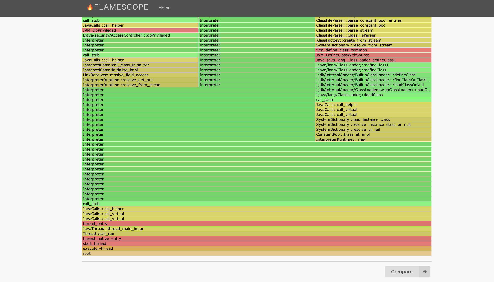
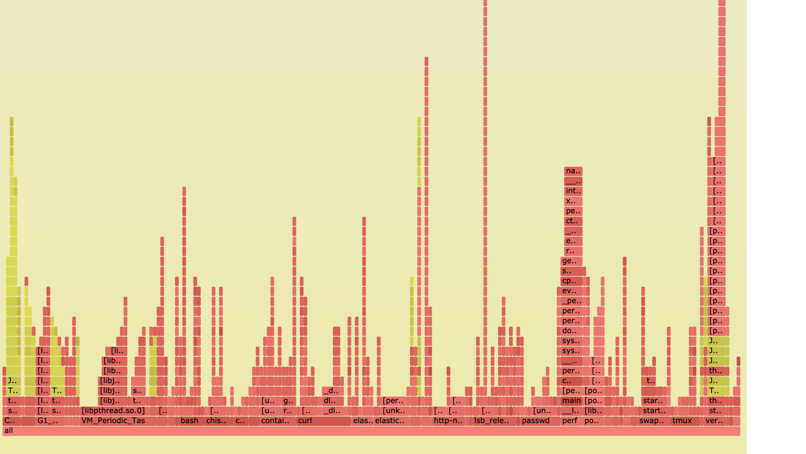

# Java-Mixed-Mode-Flame-Graphs-sample
Sample of Java-Mixed-Mode-Flame-Graphs: https://netflixtechblog.com/java-in-flames-e763b3d32166

# perf-map-agent のインストール

* 参考: [FlameScopeを使ってJavaアプリのパフォーマンス可視化](https://blog.motikan2010.com/entry/2018/04/22/FlameScopeを使ってJavaアプリのパフォーマンス可視化)

※ CentOS Linux release 7.9.2009 (Core) 上で実行

+ JDK 8 のインストール
  + `cmake` コマンドの実行には `javah` コマンドが必要だが、java10 から削除されたらしい ([参考](https://stackoverflow.com/questions/50352098/javah-missing-after-jdk-install/50353275))

```
$ sdk install java 8.0.302-open
$ java -version
openjdk version "1.8.0_302"
OpenJDK Runtime Environment (build 1.8.0_302-b08)
OpenJDK 64-Bit Server VM (build 25.302-b08, mixed mode)
```

* インストール

```
$ git clone https://github.com/jvm-profiling-tools/perf-map-agent.git
$ cd ~/perf-map-agent/
$ sudo yum -y install cmake gcc-c++
$ cmake .
$ make
```

# プロファイリング

## Java アプリケーションの起動

* https://github.com/Takaichi00/quarkus-sample で生成した jar を使用

```
$ ./mvnw clean package -DskipTests=true
$ java -XX:+PreserveFramePointer -jar target/quarkus-sample-0.0.1-SNAPSHOT-runner.jar

※ MySQL を用意していないためエラーが発生するが、叩けるエンドポイントは存在するのでここでは無視
```

## FlameScope のインストール

```
# pip がない場合は install
$ sudo yum install -y phython3
$ sudo yum install -y pip3

$ git clone https://github.com/Netflix/flamescope
$ cd flamescope
$ sudo pip3 install -r requirements.txt
$ python3 run.py
```

## FlameGraph のインストール

```
$ git clone https://github.com/brendangregg/FlameGraph.git
```

## プロファイルの実施 (FlamaScope)

```
$ cd ~/perf-map-agent/bin
$ jps | grep quarkus
7224 quarkus-sample-0.0.1-SNAPSHOT-runner.jar

$ ./create-java-perf-map.sh 7224
$ ll /tmp/perf-7224.map

$ sudo perf record -F 49 -a -g -- sleep 30

$ ls -l perf.data
$ sudo perf script --header > stacks.log

$ mv stacks.log ~/flamescope/examples/
```

* "hostname":5000 にアクセスすると、Profile が UI で確認できる



## FlameGraph

```
$ sudo bash
# perf record -F 49 -a -g -- sleep 30; ./FlameGraph/jmaps
# perf script > out.stacks01
# cat out.stacks01 | ./FlameGraph/stackcollapse-perf.pl | grep -v cpu_idle | \
    ./FlameGraph/flamegraph.pl --color=java --hash > out.stacks01.svg
```

* svg を見ると、解析情報を見ることが可能



# 参考文献

* [Java in Flames](https://netflixtechblog.com/java-in-flames-e763b3d32166)

* [CPU Flame Graphs](https://www.brendangregg.com/FlameGraphs/cpuflamegraphs.html#Java)

* [Java でつくる低レイテンシ実装の技巧](https://www.slideshare.net/nappa_zzz/java-70326737)

* [Java Mixed-Mode Flame Graphs で Java の CPU ネックをフルスタックで分析する](https://yohei-a.hatenablog.jp/entry/20160506/1462536427)

* [FlameScopeを使ってJavaアプリのパフォーマンス可視化](https://blog.motikan2010.com/entry/2018/04/22/FlameScopeを使ってJavaアプリのパフォーマンス可視化)
