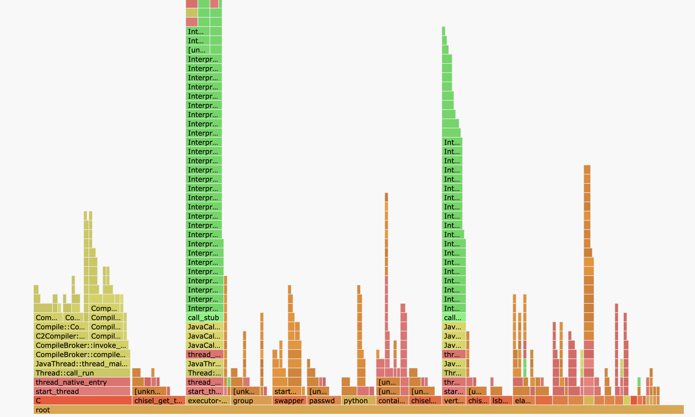
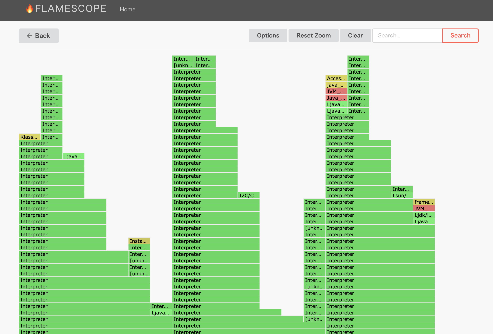
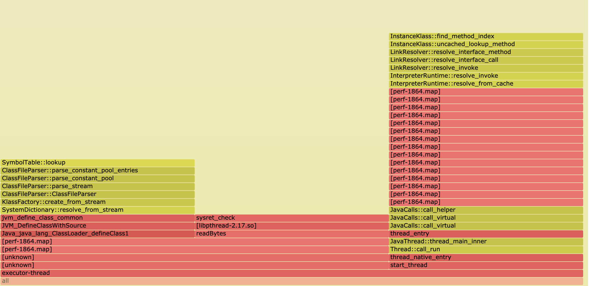

# Quarkus の起動

 ```
 ./mvnw clean package -DskipTests=true
 ```

```
$ java -jar target/quarkus-sample-0.0.1-SNAPSHOT-runner.jar

# 動作確認
$ curl localhost:8080/v1/hello
```


# プロファイルの実施 (FlamaScope)

```
$ cd ~/perf-map-agent/bin
$ jps | grep quarkus
7224 quarkus-sample-0.0.1-SNAPSHOT-runner.jar

$ ./create-java-perf-map.sh 7224
$ ll /tmp/perf-7224.map

$ sudo perf record -F 49 -a -g -- sleep 30
// 何回かリクエストを実施
$ curl localhost:8080/v1/bookmarks

$ ls -l perf.data
$ sudo perf script --header > stacks-quarkus.log

$ mv stacks.log ~/flamescope/examples/
```

* 大半が Interpreter となり、あまり有用な解析はできていない





# プロファイルの実施 (FlamaGraph)

```
$ sudo bash
# perf record -F 49 -a -g -- sleep 30; ./FlameGraph/jmaps
// 何回かリクエストを実施

$ curl localhost:8080/v1/bookmarks


# perf script -f > out.stacks01
# cat out.stacks01 | ./FlameGraph/stackcollapse-perf.pl | grep -v cpu_idle | \
    ./FlameGraph/flamegraph.pl --color=java --hash > out.stacks01.quarkus-sample.svg
```

* やはり詳細な情報は取れない。何か方法を変えたほうが良さそう



